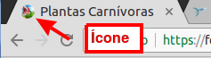

# cefet-front-end-piranha-plant

Um site informativo sobre plantas carnívoras.

## Atividade

Você tem um novo hobby: **criar plantas carnívoras**. Você encontrou um
documento solto em um antigo livro do seu tio Epaminondas e, depois de lê-lo,
decidiu **criar uma página web com seu conteúdo**.

### Exercício 1

Você deve pegar o documento do seu tio (arquivo:
`/documentos-do-tio/pagina-plantas.pdf`) e criar uma página web com o
mesmo conteúdo (não se preocupe com a formatação ainda).
Salve o arquivo como `plantas.html`.
  - A pasta `imagens` contém um dos arquivos de imagem a serem usados.
  - O título, que aparece na "aba" do navegador, deve ser "Plantas Carnívoras"
  - O arquivo `favicon.ico` deve ser usado como ícone da página

Você pode ver todas as _tags_ que precisará nos slides da aula, exceto o
ícone, cuja descrição está no FAQ a seguir.

### Exercício 2

Agora que você já criou a página, deve formatar os elementos usando código CSS.
Dentro do elemento `<head>...</head>`, ao seu final, crie um element
`<style></style>` para conter regras CSS.

## FAQ

- Ao definir uma fonte, **por que devo colocar 2 fontes** (_e.g._, `font-family: "Arial", sans-serif`)?
  - Elas são a 1ª e a 2ª opção. Ou seja, nesse caso, queremos a fonte "Arial" mas, se ela não estiver instalada no computador, pode ser a fonte `sans-serif`
    - Você pode colocar quantas opções quiser, não apenas 2.
  - "Arial" é uma fonte muito usada em editores de texto (como o Microsoft Word), assim como a fonte "Times New Roman"
  - Para facilitar a leitura e evitar que o leitor "se perca" ao ler letrinhas pequenas (tipo em jornal), os designers de fontes inventaram a serifa, que são uns tracinhos colocados nos cantos das letras (veja a imagem):

    
    - "Arial" é uma fonte **sem serifa**
    - "Times New Roman" é uma fonte **com serifa**
  - Quando colocamos `sans-serif` ou `serif` como a segunda opção, indicamos ao navegador que queremos uma fonte sem serifa (ou com serifa) qualquer, que esteja disponível. Tipo: _"quero Arial, mas se não tiver, coloque uma fonte sem serifa"_
- Quero colocar um **ícone** para minha página. #comofaz?
  - Salve uma imagem no formato `.ico` (já existe uma aqui) e, na página HTML,
    dentro do `<head></head>`, coloque:
    
    ```html
    <link rel="icon" href="favicon.ico">
    ```

    
    - Veja como definir o ícone para exibir a [página em smartphones, tablets e no Windows 8+](https://tableless.com.br/favicons/)
- Devo colocar a imagem dentro de um parágrafo ou fora dele?
  - Depende do caso. A imagem deve estar dentro do parágrafo se ela
    é uma imagem "em linha", tipo um "emoji". Se ela for uma imagem mais alta,
    provavelmente deve estar fora do parágrafo.
