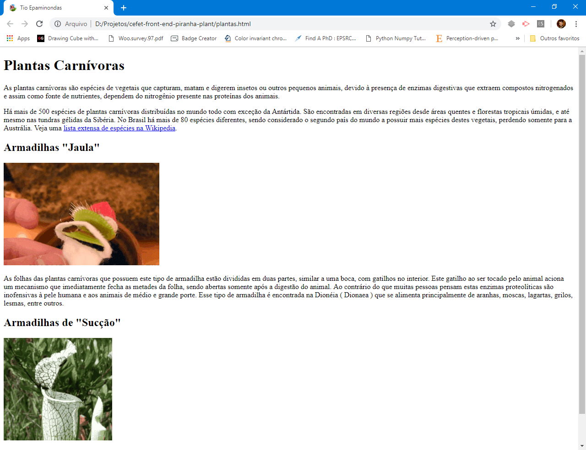
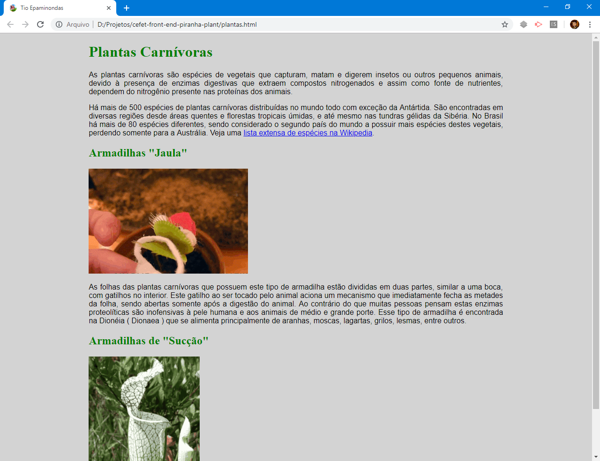

# Plantas Carnívoras

Um site informativo sobre famintas plantas carnívoras.


## Atividade

Você tem um novo hobby: **criar plantas carnívoras**. Você encontrou um
documento solto em um antigo livro do seu tio Epaminondas e, depois de lê-lo,
decidiu **criar uma página web com seu conteúdo**.

**Testando**: de tempos em tempos, atualize o navegador para ver como
a página (arquivo .html) está ficando. Faça o exercício 1 e, depois de
verificar que a página web está sendo exibida, faça o exercício 2 para
estilizara página.

**Entrega**: você deve mostrar ao professor o seu exercício para ganhar o
visto. Além disso, você deve compactar a pasta com todos os seus arquivos
em um arquivo `.zip` e então enviá-lo ao professor.


### Pré-atividade

1. Baixe o
   [arquivo compactado](https://github.com/fegemo/cefet-front-end-piranha-plant/archive/main.zip)
   que contém os documentos do tio Epaminondas e algumas imagens.
2. Descompacte em algum lugar (_e.g._, na área de trabalho).


### Exercício 1

Você deve pegar o documento do seu tio (arquivo: `documento-do-tio.pdf`)
e criar uma página web com o mesmo conteúdo (não se preocupe com a
formatação ainda, mas apenas com o código HTML). Siga os passos seguintes:

1. Crie um arquivo na pasta que foi descompactada (a que tem o arquivo
`documento-do-tio.pdf` e a pasta imagens) com o nome `plantas.html`.
1. Crie a estrutura básica de um arquivo HTML
   - Um arquivo HTML começa com a tag `<!DOCTYPE html>` e possui:
     - `<html>`: delimita a página e contém apenas o `<head>...</head>` e o
       `<body>...</body>` (sempre, toda página web é assim)
       - `<head>`: contém _tags_ que definem algumas informações (metadados)
         sobre a página
         - `<title>`: o título da página que aparece na aba do navegador
       - `<body>`: tudo o que é visível na página: títulos, parágrafos, imagens
         etc.
       - VEJA A DESCRIÇÃO da
         [estrutura de um arquivo HTML nos slides][estrutura]
   - O título, que aparece na "aba" do navegador, deve ser **Tio Epaminondas**
   - O arquivo `favicon.ico` deve ser usado como ícone da aba página. Para saber
     como definir o ícone da aba, veja o [FAQ](#faq)
1. Vá "recheando" a página com as _tags_ para:
   - Título de primeiro nível
   - Parágrafos
     - Hiperlink (dentro do parágrafo)
   - Título de segundo nível
   - Imagem
   - Parágrafo
   - Título de segundo nível
   - Imagem
   - Parágrafo

Você pode ver todas as _tags_ que precisará nos slides da aula, exceto o
ícone, cuja descrição está no FAQ a seguir.

Ao final desta etapa, a página se parece com a imagem a seguir:




### Exercício 2

Agora que você já criou a página, deve formatar os elementos usando código CSS.
Dentro do elemento `<head>...</head>`, logo antes de fechá-lo, crie um elemento
`<style></style>` para conter o código com as regras CSS que você vai criar.
Siga os passos:

1. Crie o elemento `<style>...</style>` ao final (mas dentro) do
   `<head>...</head>`
1. Crie uma regra para o elemento `body` (corpo da página) para:
   - Definir a cor de fundo (`background-color`) como cinza claro (`lightgray`)
   - Definir uma margem à esquerda (`margin-left`) e margem à direita
     (`margin-right`) como 15% da largura total
1. Crie uma regra para estilizar os títulos de primeiro e de segundo nível
   - Definir a família da fonte e a cor (conforme especificado no pdf)
1. Crie uma regra para estilizar os parágrafos
   - Alinhando seu texto de maneira justificada
   - Definindo a família da fonte

As propriedades CSS (para definir cor de fundo, cor do texto, margem etc.)
podem ser encontradas nos slides da aula.

Ao final deste exercício, a página deve ser parecer com esta imagem:




## FAQ

- Quero colocar um **ícone** para minha página. #comofaz?
  - Salve uma imagem no formato `.ico` (já existe uma aqui) e, na página HTML,
    dentro do `<head></head>`, coloque:

    ```html
    <link rel="icon" href="favicon.ico">
    ```

    
    - Veja como definir o ícone para exibir a
      [página em smartphones, tablets e no Windows 8+](https://tableless.com.br/favicons/)
- Ao definir uma fonte, **por que devo colocar 2 fontes**
  (_e.g._, `font-family: "Arial", sans-serif`)?
  - Elas são a 1ª e a 2ª opção. Ou seja, nesse caso, queremos a fonte
    "Arial" mas, se ela não estiver instalada no computador, pode ser a
    fonte `sans-serif`
    - Você pode colocar quantas opções quiser, não apenas 2.
  - "Arial" é uma fonte muito usada em editores de texto (como o Microsoft
    Word), assim como a fonte "Times New Roman"
  - Para facilitar a leitura e evitar que o leitor "se perca" ao ler
    letrinhas pequenas (tipo em jornal), os designers de fontes inventaram
    a serifa, que são uns tracinhos colocados nos cantos das letras
    (veja a imagem):

    
    - "Arial" é uma fonte **sem serifa**
    - "Times New Roman" é uma fonte **com serifa**
  - Quando colocamos `sans-serif` ou `serif` como a segunda opção, indicamos
    ao navegador que queremos uma fonte sem serifa (ou com serifa) qualquer,
    que esteja disponível. Tipo: _"quero Arial, mas se não tiver, coloque
    uma fonte sem serifa"_
- Devo colocar a imagem dentro de um parágrafo ou fora dele?
  - Depende do caso. A imagem deve estar dentro do parágrafo se ela
    é uma imagem "em linha", tipo um _emoji_. Se ela for uma imagem maior,
    provavelmente deve estar fora do parágrafo.

[estrutura]: https://fegemo.github.io/cefet-front-end/classes/html1/#estrutura-basica-html